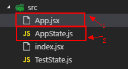

## mobx 学习记录

> 如果只是学习如何使用mobx,那么我们从一个最简单的例子着手，最近在逛知乎的时候，看到不少介绍mobx的文章，于是打算尝试一下，其中我打算找mobx-react github 上提供的最简单的例子试验一下，以便于我对其有大致的了解。下面我直接提供一下官方提供的一个简单例子的地址：https://github.com/mobxjs/mobx-react-boilerplate

接下来我做的第一件事情是下载了一个mobx的chrome调试插件，打算看看其内部的数据流动是什么样子的。

首先看一下其的目录结构:


其中app,jsx中的代码：

```javascript
import React, { Component } from 'react';
import { observer } from 'mobx-react';
import DevTools from 'mobx-react-devtools';

@observer
class App extends Component {
  render() {
    return (
      <div>
        <button onClick={this.onReset}>
          Seconds passed: {this.props.appState.timer}
        </button>
        <DevTools />
      </div>
    );
  }

  onReset = () => {
    this.props.appState.resetTimer();
  }
};

export default App;
```

AppState.js中的代码：

```javascript
import { observable } from 'mobx';

class AppState {
  @observable timer = 0;

  constructor() {
    setInterval(() => {
      this.timer += 1;
    }, 1000);
  }

  resetTimer() {
    this.timer = 0;
  }
}

export default AppState;
```

其实从文件命名来看，mobx做了一件事件，那就是把react组件的页面与组件的状态分离了，组件的状态是由mobx进行管理的，每个react组件都会对应一个由mobx组织的状态，通过绑定到组件的props中进行调用，组件的数据和操作数据的方法会包装成一个mobx创建的对象传递到组件的props中。

一个组件可能会用到多个组件的方法，只需要按照需要添加到组件的props当中就可以了，感觉和dva、vue全家桶一类的组件和组件的状态及数据改变模式比较的类似。以上大概知道怎么用了，绝知此事要躬行。。。。