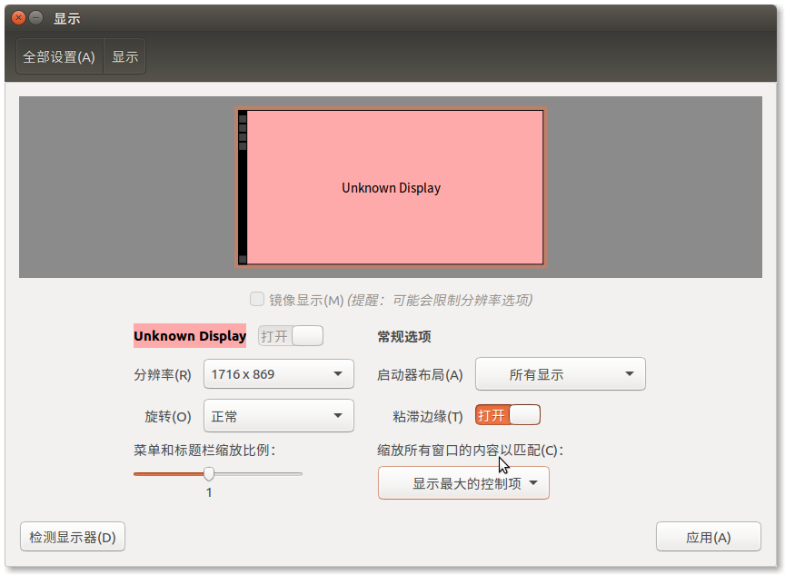

## Ubuntu 服务器环境准备

电脑的内存加到16G,感觉自己如果是不折腾下的话，都有点浪费了，看了一下，在我正常使用的情况下，内存才使用了25%，于是显示做了个内存盘，然后在虚拟机里面跑了个Ubuntu，感觉还不赖，无论是主机win10还是客户几Ubuntu都没有卡顿。

1、Ubuntu虚拟机中安装完成后，可能屏幕很小？

你需要：右上角 系统设置->显示->将屏幕分辨率调整到最大。



以上工作完成后，在虚拟机顶部的工具栏中选择查看->立即适应客户机，则屏幕的尺寸则会随着主机的大小改变而改变。

2、设置系统文字为中文

你需要： 右上角 systemsetting->languagesupport->addordeletelanguage

点击该按钮后如下图：


选择对应的语言并下载，最后在语言的设置页通过鼠标拖动，将中文简体拖动到第一行，确认保存后，系统语言则设置为了中文。

3、配置node开发环境

node 的配置请参考文档1，通过nvm安装node是比较好的选择，不同版本的node之间的切换非常的方便，更好的使用nvm可使用nvm的help命令，该文虽然很久就已经写了，但是在2017-03-23在Ubuntu16.04的环境下实验是没有问题的。

4、Java开发环境的配置

Java开发环境的配置请参考文档2，其中需要注意的是你可能需要安装一下vim软件，如果你没有安装过的话，你可执行一下vim命令，如果没有安装该软件，则会提示安装该软件的命令，按照该命令安装即可。

其中几个可能会用到的vim命令如下：

打开文件： ````vim [filename]````
插入内容： ````a````
保存修改： ````Esc->Ctrl+:->wq````
放弃修改： ````Esc->Ctrl+:->q！````

5、安装MySQL请参考文档3，

安装过程中需要注意的主要有，我安装的MySQL的版本为5.7的版本，所以晚上的很多的命令是用不了的，是因为在新版本中的user表中是不存在password这个字段，该字段改为：
authentication_string,所以相应的一些网上搜索到的新增、修改涉及到用户密码的部分都需要注意，密码字段的修改。

同时还需要注意的地方主要为，在Linux的命令行中执行MySQL命令时需要给命令的最后添加“；”。

在user表中存在这样的一个字段为：localhost，如果该字段的值为localhost，则表示该用户只能在本机访问数据库，而不能远程访问，如果需要能够远程访问，首先需要将用户的该字段改为“%”，此外还需要配置MySQL中相关的配置文件，需要注释掉配置文件中的配置项：bindaddress: 127.0.01。

MySQL默认是不接受中文字符串的，我在MySQL安装完成后，通过navicat同步远程数据库到本地后，通过一个现有的项目链接数据库，但是在连接的过程中出现问题，用户提交的中文字段是无法正确的存储的，除了在连接的时候需要设置utf-8:```jdbc.url=jdbc:mysql://localhost:3306/[databaseName]?useUnicode=true&characterEncoding=utf8```,还需要对```character_set_database```进行设置，通过一下的命令查看字符集设置：```show variables like 'character_set_%';```，查看结果如下：
```result
+--------------------------+----------------------------+
| Variable_name            | Value                      |
+--------------------------+----------------------------+
| character_set_client     | utf8                       |
| character_set_connection | utf8                       |
| character_set_database   | latin1                     |
| character_set_filesystem | binary                     |
| character_set_results    | utf8                       |
| character_set_server     | latin1                     |
| character_set_system     | utf8                       |
| character_sets_dir       | /usr/share/mysql/charsets/ |
+--------------------------+----------------------------+
```
我们可以看到不能显示汉字就是因为character_set_database 的Value值为latin1；不能显示汉字就是因为character_set_database 的Value值为latin1；


attention：如果你是用navicat同步数据库的存储过程的话，是需要数据库的最高权限的，如果在Java项目中使用存储过程，那么在数据库的配置文件中设置的账号需要与存储过程创建的账号保持一致。

### 参考文档

[1][ubuntu下nvm,node以及npm的安装与使用](http://blog.csdn.net/minchina91/article/details/40260263)<br/>
[2][Ubuntu 16.04配置Java开发环境](http://www.cnblogs.com/deitymon/p/5926619.html)<br/>
[3][Ubuntu下安装MySQL及简单操作](http://www.linuxidc.com/Linux/2016-07/133128.htm)<br/>
[4][ 解决Navicat无法连接到MySQL的问题](http://blog.csdn.net/mtbaby/article/details/56836986)<br/>
[5][ MySQL添加用户、删除用户与授权](http://www.cnblogs.com/wanghetao/p/3806888.html)
